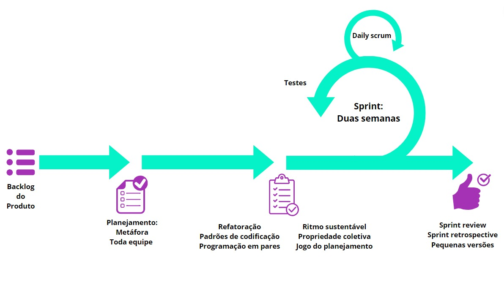

## Histórico de Revisão

| Data | Versão | Descrição | Autores |
| ---------- | ----------- | -------------- | -------------- |
| 25/09/2023 | 0.1 | Adicionando os processos de desenvolvimento | Júlia Yoshida |
| 25/09/2023 | 0.2 | Atualizando atividades de engenharia de requisitos | Júlia Yoshida, Luana Ribeiro e Yasmim Oliveira |

## Metodologias

|Abordagem|Ciclo de vida|Processo|
|-|-|-|
|Ágil|Iterativo/Incremental|Scrum/XP|

 No processo de desenvolvimento de uma aplicação, é importante ter em mente  que o êxito do projeto não se restringe apenas à codificação. O sucesso depende igualmente da identificação das características da aplicação, para que a partir disso, possamos escolher as metodologias que melhor atendem às nossas necessidades. 

 A grande diferença entre uma abordagem dirigida à plano para uma ágil é a limitação que cada projeto possui, para o Matriculaí suas limitações estão no tempo e nos recursos financeiros o que direciona o projeto para uma abordagem ágil. Ao afunilar o universo de processo de desenvolvimento após a escolha da abordagem, o ciclo de vida se atém ao contato constante (ou não) com o cliente que, particularmente, se dispôs a ter um contato frequente com a equipe. O processo se deu ao utilizar o framework Sommerville que é um conjunto de perguntas de cárater técnico, organizacional e humano que nos proporcionou a segurança para eleger o Scrum/XP além de fatores como a familiaridade da equipe, o foco em feedback constante e entregas de valor.  Na tabela a seguir estão as atividades de engenharia de requisitos que serão realizadas durante o desenvolvimento do software:  

|Nome da atividade|Método|Momento na Sprint|Ferramenta|Entrega|
|-|-|-|-|-|
|Elicitação e Descoberta|- Reuniões com o cliente|- Sprint Review - Sprint Planning|- Google Meet - Notion|- Diagrama de Ishikawa - Documentação da reunião com o cliente|
|Análise e Consenso |- Estudo individual e reunião entre a equipe  - Reunião de confirmação com o stakeholder|- Sprint Planning - Entre a Planning e a Review - Sprint Review|- Google Meet  - Notion |- Backlog de requisitos - Backlog da sprint - Documentação da validação do cliente|
|Declaração|- História de usuário|- Sprint Planning - Durante a sprint caso necessário|- Notion|- Backlog de requisitos com histórias de usuário|
|Representação|- Prototipação|- Sprint Planning - Sprint Review|- Figma|- Protótipo|
|Verificação e Validação|- Testes na aplicação e de validação do cliente - Reunião com o cliente|- Testes durante a sprint - Sprint Review|- Google forms - Ferramentas de teste|- Documentação dos testes  - Documentação do feedback do cliente|
|Organização e Atualização|Listagem dos requisitos - Reuniões entre a equipe - Reuniões com o stakeholder|- Sprint Planning - Sprint Review - Atividades durante a sprint|- Notion - Discord  - Google Meet|- Documentação atualizada  - Aplicação atualizada|

### Configurações do processo de engenharia de requisitos: Participativo

|Alvo|Propósito|Tempo|
|-|-|-|
|Cliente específico|Exploratório|Iterativo|

## SCRUM

| Evento | Descrição |
| --- | --- |
| Daily Scrum | 
 Reunião diária com duração máxima de 15 minutos, na qual os membros da equipe devem discutir o progresso de trabalho da Sprint desde a última reunião diária. 
|
| Sprint Planning | 
 Reunião realizada no inicio de cada sprint com o intuito de definir as entregas da sprint em questão. 
|
| Sprint Retrospective | 
 Essa reunião ocorrerá ao fim de cada sprint e terá como objetivo analisar a dinâmica de trabalho da equipe e das ferramentas utilizadas, procurando melhorar se algo deixar a desejar. 
|
| Sprint Review	| 
 Durante a Sprint Review, faremos a revisão dos resultados da Sprint, a validação do que foi implementado, o alinhamento de expectativas e atualização do Product Backlog com a presença do cliente. 
|
| Product Backlog | 
 Lista priorizada dos requisitos do produto que precisam ser desenvolvidos para atender aos objetivos do projeto. 
|

## Estratégias eXtremme Programming

| Estratégia | Descrição |
| --- | --- |
| Propriedade Coletiva | 
 Qualquer membro da equipe pode alterar qualquer parte do código da aplicação a qualquer momento. 
|
| Ritmo Sustentável | 
 Evita a sobrecarga de trabalho e o esgotamento dos membros da equipe.  
 |
| Metáfora | 
 Explicar o projeto de forma simples auxilia o time e o cliente a entender os elementos do sistema. 
 |
| Refatoração | 
 Melhorar o código existente sem alterar sua funcionalidade. 
 |
| Programação em Pares | 
  É uma abordagem colaborativa em que dois desenvolvedores trabalham juntos em um único código, compartilhando conhecimentos e habilidades para melhorar a qualidade e eficiência do desenvolvimento de software. 
 |
| Jogo de Planejamento | 
 Será utilizado no início de cada Sprint da metodologia SCRUM para priorizar as funcionalidades e definir as tarefas que serão realizadas. 
 |
| Toda a Equipe | 
 Fomenta a colaboração entre todos os membros da equipe para resolver problemas e atingir os objetivos do projeto, o que resulta em maior produtividade e na redução de conflitos entre os membros.
 |
| Pequenas Versões | 
 Tornam o acompanhamento do progresso do projeto mais claro e objetivo, facilitando a identificação mais rápida de problemas tanto para a equipe quanto para o cliente. 
 |
| Padrões de codificação | 
 Uma codificação padronizada facilita a comunicação, encoraja a posse coletiva e evita problemas na programação. 
 |

## Representação Scrum/XP

