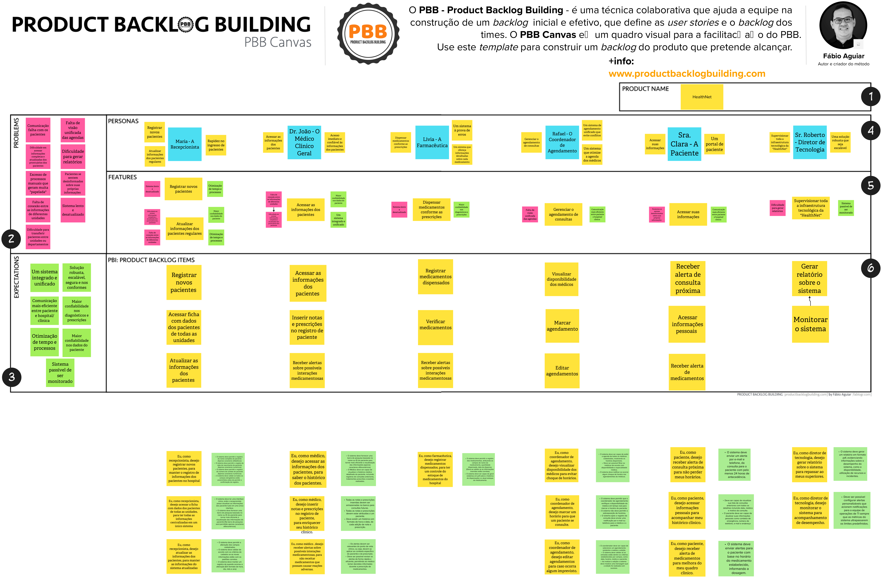
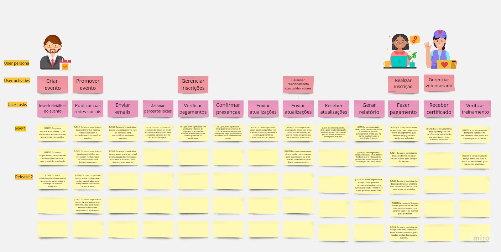
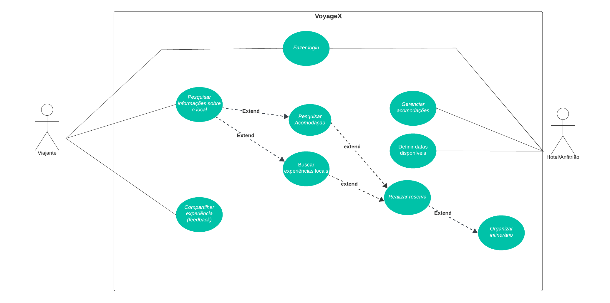

| Data | Versão | Descrição | Autores |
| ---------- | ----------- | -------------- | -------------- |
| 21/11/2023 | 0.1 | Adição das Atividades | Luana Ribeiro |
| 13/12/2023 | 1.1 | Adição atividades unidade 4 | Luana Ribeiro, Gabriel Esteves, Yan Luca |

# Exercícios da Equipe

Exercícios realizados pela equipe sobre os temas abordados em aula.

## PBB

O Product Backlog Building é um método e um Canvas para a elaboração e a criação de um Product Backlog. O Canvas PBB é a ferramenta que facilita o método de Product Backlog Building. Tem como objetivo ajudar na construção e no refinamento do Product Backlog de forma colaborativa – construindo um entendimento compartilhado e levando todos os envolvidos à compreensão do produto – e na preparação do backlog para o time começar a trabalhar de modo ágil e eficaz. (Marsicano,2023)

<iframe width="768" height="432" src="https://app.mural.co/embed/c555eefb-fc78-4ab3-a91a-d3179d1685d8" frameborder="0" scrolling="no" allowfullscreen></iframe>

## USM

O User Story Mapping é uma ferramenta valiosa para o desenvolvimento de software. É uma maneira de trabalhar com histórias de usuários à medida que são usadas em processos Ágeis. É o Backlog do Produto estruturado visualmente. (Marsicano,2023)

<iframe width="768" height="432" src="https://miro.com/app/board/uXjVNOGgoC8=/?share_link_id=985851515063" frameborder="0" scrolling="no" allowfullscreen></iframe>

## Casos de Uso - VoyageX

Um caso de uso é uma descrição textual ou gráfica de uma sequência de ações que um ator realiza para atingir um objetivo específico. Um ator é uma pessoa ou um sistema que interage com o sistema.

Os casos de uso são geralmente organizados em um diagrama de casos de uso, que é uma representação gráfica dos casos de uso e seus relacionamentos.

A metodologia de casos de uso é uma técnica versátil que pode ser usada para projetar sistemas de software de todos os tamanhos e complexidades. Ela é particularmente útil para sistemas que envolvem interações complexas entre usuários e sistemas.

Os principais benefícios da metodologia de casos de uso incluem:

- Ajuda a garantir que os requisitos funcionais do sistema sejam capturados de forma completa e precisa;
- Facilita a comunicação entre os stakeholders do sistema, incluindo usuários, desenvolvedores e gerentes;
- Fornece uma base sólida para o desenvolvimento e teste do sistema.
- A metodologia de casos de uso é uma ferramenta importante para o desenvolvimento de software de sucesso. Ela pode ajudar a garantir que os sistemas sejam projetados de forma a atender às necessidades dos usuários e a serem desenvolvidos e testados de forma eficaz.

### Diagrama de Casos de Uso

### Escpecificação de Casos de Uso

### UC: Pesquisar informações sobre o local

<b>1. Pesquisar informações sobre o local </b> 
    
 <b>1.1</b> Breve Descrição 

     
 O caso de uso "Pesquisar Informações sobre o Local" permite que o Viajante busque e obtenha informações detalhadas sobre um destino específico, contribuindo para a tomada de decisões informadas sobre a reserva de acomodações, atividades e experiências personalizadas.

    
<b>1.2</b> Atores

    
 Viajante

<b>2. Fluxo Básico de Eventos </b> 
    
<b>2.1</b> O Viajante acessa a funcionalidade de pesquisa no aplicativo.<b>[FA02]</b>   

    
<b>2.2</b> sistema exibe uma interface para inserção de parâmetros de pesquisa, como destino, datas, preferências e interesses. <b>[FA01] [RN01]</b>  

    
<b>2.3</b> O Viajante insere os critérios desejados e inicia a pesquisa.  

    
<b>2.4</b> O sistema realiza uma busca e apresenta uma lista de destinos correspondentes aos critérios. <b>[RN02]</b> 

    
<b>2.5</b> O Viajante seleciona um destino específico para obter informações detalhadas.<b>[RN03]</b> 

    
<b>2.6</b> O sistema exibe informações sobre acomodações disponíveis, atividades locais, recomendações personalizadas e avaliações de outros usuários. 

    
<b>2.7</b> O caso de uso é encerrado 

<b>3.  Fluxos Alternativos </b> 
    
<b> 3.1 [FA01] Pesquisa Avançada</b> 

    
<b> 3.1.1 </b> O Viajante opta por utilizar a pesquisa avançada. 

    
<b> 3.1.2</b> O sistema oferece opções adicionais, como filtrar por preço, comodidades, classificações, etc. 

    
<b> 3.1.3 </b> O Viajante ajusta os filtros conforme suas preferências. 

    
<b> 3.1.4</b> O sistema refaz a pesquisa considerando os novos critérios. 

    
<b> 3.1.5 </b> O Viajante visualiza os resultados refinados e retorna para o item 2.4. 

    
<b> 3.2 [FA02] Recomendações personalizadas</b> 

    
<b> 3.2.1</b> O Viajante recebe recomendações personalizadas antes de iniciar a pesquisa. 

    
<b>3.2.2</b> O sistema utiliza dados de viagens anteriores e preferências registradas. 

    
<b>3.2.3</b> O Viajante visualiza destinos, acomodações e atividades recomendadas. 

    
<b>3.2.4</b> O Viajante seleciona uma recomendação para obter detalhes adicionais e retorna para o item 2.7.

<b>4. Fluxos de Exceção </b> 
    
<b> 4.1 [FE01] Pesquisa Avançada</b> 

    
<b> 4.1.1 </b> O Viajante opta por utilizar a pesquisa avançada. 

<b>5.Pré-Condições</b>   
     
<b> 5.1 Autenticação</b> 

     
 <b>5.1.1</b> O viajante precisa estar autenticado no aplicativo 

<b>6.  Pós-Condições </b> 
    
 N/D

<b>7.  Pontos de Extensão </b> 
    
 N/D

<b>8.  Requisitos Especiais </b> 
    
 N/D

<b>9.  Regras de Negócio </b> 
     
<b> 9.1 RN01</b> -  A pesquisa deve ser realizada com apenas caracteres alfanuméricos, e as datas devem estar no formato “dia/mês/ano” 

     
<b> 9.2 RN02</b> - A lista de resultados deve estar em ordem alfabética 

     
<b> 9.3 RN03</b> - Ao selecionar um destino, deve aparecer uma janela de confirmação, antes de continuar o fluxo. 

   

### UC: Compartilhar Experiência (Feedback)

<b>1. Pesquisar informações sobre o local </b> 
    
 <b>1.1</b> Breve Descrição 

     
 O caso de uso "Compartilhar Experiência (Feedback)" permite que o Viajante compartilhe suas experiências e avaliações sobre acomodações, atividades e destinos visitados, contribuindo para o sistema de avaliação e feedback do aplicativo.

    
<b>1.2</b> Atores

    
 Viajante

<b>2. Fluxo Básico de Eventos </b> 
    
<b>2.1</b> O caso de uso se inicia quando o viajante acessa a seção de "Minhas Experiências" no aplicativo.
  

    
<b>2.2</b> O viajante seleciona a opção para "Compartilhar Experiência". <b>[FA02] [RN01]</b>  

    
<b>2.3</b> O viajante escolhe o tipo de experiência a ser compartilhada (acomodação, atividade, destino).<b>[FA01]</b>  

    
<b>2.4</b> O viajante insere os detalhes da experiência, incluindo avaliação, comentários e fotos, se aplicável. <b>[RN02]</b> 

    
<b>2.5</b> O viajante confirma a submissão da avaliação. 

    
<b>2.6</b> O sistema registra a avaliação na plataforma.<b>[RN03]</b> 

    
<b>2.7</b> O caso de uso é encerrado 

    

<b>3.  Fluxos Alternativos </b> 
    
<b> 3.1 [FA01] Avaliação interrompida
</b> 

    
<b> 3.1.1 </b> O Viajante inicia o processo de avaliação, mas interrompe antes de confirmar a submissão.. 

    
<b> 3.1.2</b> O sistema salva um rascunho da avaliação para conclusão posterior e retorna para o item 2.7.
    
<b> 3.2 [FA02]  Avaliação vinculada a uma reserva
</b> 

    
<b> 3.2.1</b> O Viajante compartilha uma experiência vinculada a uma reserva específica. 

    
<b>3.2.2</b> O sistema utiliza dados de viagens anteriores e preferências registradas. 

    
<b>3.2.3</b> O Viajante visualiza destinos, acomodações e atividades recomendadas. 

    
<b>3.2.4</b> O Viajante seleciona uma recomendação para obter detalhes adicionais e retorna para o item 2.7.

<b>4. Fluxos de Exceção </b> 
    
<b> 4.1 [FE01] Avaliação Incompleta</b> 

    
<b> 4.1.1 </b> Se o Viajante tentar submeter uma avaliação sem preencher todos os campos obrigatórios. 

    
<b> 4.1.2 </b> O sistema alerta sobre a necessidade de preencher todos os campos antes da submissão. 

    
<b> 4.2 [FE02] Avaliação Duplicada</b> 

    
<b> 4.2.1 </b> Se o Viajante tentar submeter uma avaliação para a mesma acomodação, atividade ou destino mais de uma vez.
 

    
<b> 4.2.2 </b> O sistema alerta sobre a duplicidade e oferece a opção de editar a avaliação existente. 

<b>5. Pré-Condições </b> 
     
<b> 5.1 Autenticação</b> 

     
 <b>5.1.1</b> O viajante precisa estar autenticado no aplicativo 

<b>6.  Pós-Condições</b>  
    
 A avaliação é registrada no sistema e fica disponível para outros usuários visualizarem.

<b>7.  Pontos de Extensão </b> 
    
 N/D

<b>8.  Requisitos Especiais </b> 
    
<b>8.1 Revisar avaliação</b>

    
<b>8.1.1 </b>Antes da publicação, o Viajante tem a opção de revisar sua avaliação.

    <b>9. Informações adicionais </b>  
    
 O sistema notifica o Viajante sobre qualquer ação relacionada à sua avaliação, como novos comentários ou moderação.

<b>10.  Regras de Negócio </b> 
     
<b> 10.1 RN01</b> - Ao selecionar a opção de “compartilhar experiência”, deve-se aparecer um box de confirmação. 

     
<b> 10.2 RN02</b> - O comentário sobre a experiência deve ser limitado a 500 caracteres e as fotos enviadas devem estar em formato .png. 

     
<b> 10.3 RN03</b> - AAo registrar a avaliação na plataforma, deve aparecer uma mensagem de confirmação,  informando que a avaliação foi registrada com sucesso.
 

   

### UC: Gerenciar Acomodações

<b>1. Gerenciar Acomodações </b> 
    
 <b>1.1</b> Breve Descrição 

     
 O caso de uso "Gerenciar Acomodações" permite que o Anfitrião do aplicativo gerencie as informações relacionadas às acomodações disponíveis para reserva.

    
<b>1.2</b> Atores

    
 Anfitrião

<b>2. Fluxo Básico de Eventos </b> 
    
<b>2.1</b> O caso de uso se inicia quando o anfitrião acessa o painel de controle das suas acomodações. <b>[FA01][FA02]</b>   

    
<b>2.2</b> O sistema exibe a lista de acomodações associadas ao Anfitrião. <b>[RN01]</b>  

    
<b>2.3</b> O Anfitrião seleciona uma acomodação para gerenciar.
  

    
<b>2.4</b> O sistema apresenta as opções de edição para a acomodação escolhida. 

    
<b>2.5</b> O Anfitrião realiza as alterações desejadas, como atualizar descrição, definir preços, adicionar fotos, etc.<b>[RN02]</b> 

    
<b>2.6</b> O Anfitrião salva as alterações. 

    
<b>2.7</b> O sistema confirma a atualização e exibe a confirmação. <b>[RN03]</b> 

    
<b>2.8</b> O caso de uso é encerrado 

<b>3.  Fluxos Alternativos </b> 
    
<b> 3.1 [FA01] Solicitação de reserva</b> 

    
<b> 3.1.1 </b> O Anfitrião recebe uma solicitação de reserva. 

    
<b> 3.1.2</b> O sistema notifica o Anfitrião.  

    
<b> 3.1.3 </b> O Anfitrião acessa a solicitação pendente. 

    
<b> 3.1.4</b> O Anfitrião aceita ou rejeita a solicitação. 

    
<b> 3.1.5 </b> O sistema atualiza o status da reserva, notifica o usuário e retorna para o item 2.3. 

    
<b> 3.2 [FA02] Notificação de avaliação </b> 

    
<b> 3.2.1</b> O Anfitrião recebe uma avaliação de um hóspede. 

    
<b>3.2.2</b> O sistema notifica o Anfitrião sobre a avaliação.  

    
<b>3.2.3</b> O Anfitrião visualiza a avaliação e responde, se desejar. 

    
<b>3.2.4</b> O sistema atualiza a avaliação e exibe as respostas e retorna para o item 2.8. 

<b>4. Fluxos de Exceção </b> 
    
<b> 4.1 [FE01] Falha na Atualização</b> 

    
<b> 4.1.1 </b> O Anfitrião tenta salvar as alterações. 

     
<b> 4.1.2 </b> O sistema detecta um erro. 

     
<b> 4.1.3 </b> O sistema exibe uma mensagem de erro e sugere correções. 

    
<b> 4.2 [FE02] Indisponibilidade do Sistema</b> 

    
<b> 4.2.1 </b> O Anfitrião tenta acessar o painel de controle. 

     
<b> 4.2.2 </b> O sistema está temporariamente indisponível. 

     
<b> 4.2.3 </b>O sistema exibe uma mensagem informando sobre a indisponibilidade. 

<b>5. Pré-Condições </b> 
     
<b> 5.1 Autenticação</b> 

     
 <b>5.1.1</b> O Anfitrião está autenticado no sistema. 

     
<b>6. Pós-Condições  </b> 
    
 <b>6.1 Atualização de sistema</b>

    
 <b>6.1.1</b> As alterações nas acomodações são refletidas no sistema. 

<b>7. Pontos de Extensão  </b> 
    
<b> 7.1 Extensão de Promoção Especial</b>

    
 <b>7.1.1</b> O Anfitrião pode optar por criar uma promoção especial para sua acomodação durante um período específico. 

<b>8.  Requisitos Especiais </b> 
    
 <b>8.1 Requisito Especial</b>

    
 <b>8.1.1</b> O sistema deve oferecer suporte multilínguistico para as descrições das acomodações. 

<b>9.  Regras de Negócio </b> 
     
<b> 9.1 RN01</b> - A lista de acomodações associadas ao anfitrião deve estar em ordem alfabética. 

     
<b> 9.2 RN02</b> - A descrição deve ser de no máximo 240 caracteres e o preço deve estar em apenas caracteres numéricos. 

     
<b> 9.3 RN03</b> - Ao salvar as alterações deve aparecer uma mensagem de confirmação, que as alterações foram realizadas com sucesso. 

 