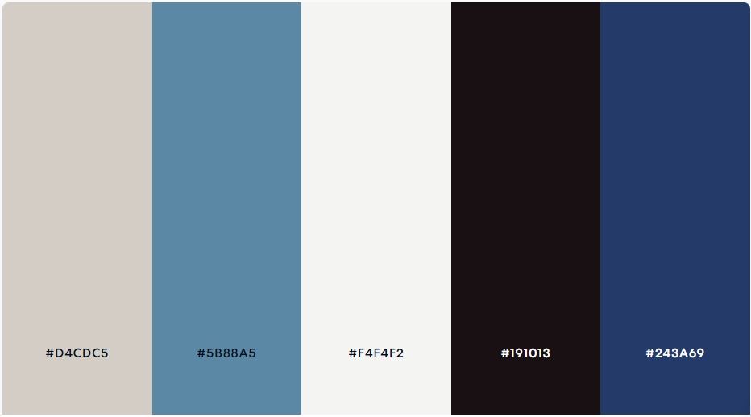
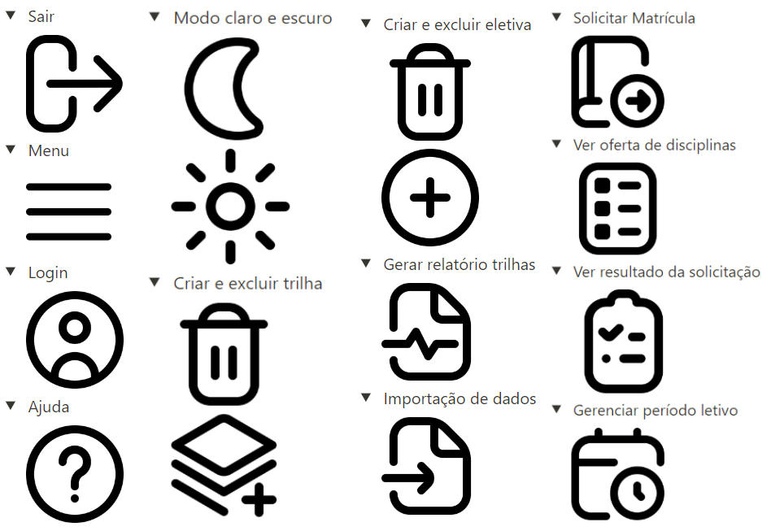

## Histórico de Revisão

| Data | Versão | Descrição | Autores |
| ---------- | ----------- | -------------- | -------------- |
| 15/11/2023 | 0.1 | Adicionando os padrões de interface | Júlia Yoshida |

# Paleta de cores

 Essa é a paleta de cores que será utilizada. 

# Tipografia

 A fonte escolhida é a Cabin. A mesma está presente em 4 diferentes tipos de proporções, podendo ser observada abaixo. 

Tamanhos:

- Título: 32 pt.
- Subtítulo: 24 pt.
- Texto: 18 pt.
- Descrição: 12 pt.

# Ícones

# Componentes

O produto foi idealizado contendo três componentes estruturando a tela principal, sendo um ***Header***, um ***Content*** e um ***Footer***.

### Header

 O Header do produto tem a função de conter itens que possam auxiliar o usuário durante a navegação do site, estando sempre fixos e de fácil acesso. 

Os itens do header que aparecerão para todos os usuários serão:

- *Botão de modo claro/escuro*: botão que permite o usuário mudar para o modo claro ou modo escuro;
- *Botão de menu*:
    - *Sair*: permite que o usuário faça logout da aplicação;
    - *Ajuda*: leva o usuário para uma página com um manual de informações de uso da aplicação.
- *Nome da aplicação clicável que leva pra página Home*.

Os itens do header exclusivos para o administrador serão:

- No botão de menu, teremos os seguintes itens:
    - *Criar e excluir trilha*: leva o administrador para uma página em que ele possa criar ou excluir trilhas;
    - *Criar e excluir eletiva*:  leva o administrador para uma página em que ele possa criar ou excluir eletivas;
    - *Gerar relatório de trilhas*: leva o administrador para uma página em que ele possa gerar relatório sobre as trilhas;
    - *Gerenciar período letivo*:  leva o administrador para uma página em que ele possa abrir ou fechar o período letivo;
    - *Importação de dados*:  leva o administrador para uma página em que ele possa importar dados sobre os alunos.

Os itens do header exclusivos para os alunos serão:

- No botão de menu, teremos os seguintes itens:
    - *Solicitar matrícula*:  leva o aluno para uma página em que ele possa solicitar matrícula nas trilhas e eletivas disponíveis;
    - *Ver oferta de disciplinas*: leva o aluno para uma página em que ele possa ver as trilhas e eletivas disponíveis;
    - *Ver resultado da solicitação*: leva o aluno para uma página em que ele possa ver o resultado das suas solicitações de matrícula.

### Content

 Este componente serve para apresentar o conteúdo do tópico selecionado, sendo o núcleo flexível da página que se adapta conforme a escolha feita no menu de navegação. 

### Footer

 Este componente tem como objetivo abrigar informações de direitos autorais, além do ano de desenvolvimento e links para as redes sociais do cliente. 

# Estilos de interação

 Um modelo conceitual é uma representação de alto nível do sistema, fornecendo uma abstração estruturada que facilita a compreensão da interação usuário-sistema. Utilizaremos duas abordagens principais:

-  
 Manipulação e navegação: envolve ações como arrastar, selecionar, abrir, fechar e ampliar em objetos virtuais. É influenciada pelo conhecimento dos usuários sobre como se movem e manipulam no mundo físico.

-  
Exploração e navegação:  é um modelo conceitual onde os usuários interagem com o sistema
através da exploração de objetos, menus, links, e elementos interativos para encontrar o que desejam. 

# Design de interface

Para projetar uma interface pensada na experiência do usuário, utilizaremos as Heurísticas de Jakob Nielsen para guiar e validar o desenvolvimento de nossa aplicação. As heurísticas de Nielsen foram pensadas para diminuir a carga cognitiva do usuário, permitindo que sua navegação e experiência sejam mais aprimoradas e menos cansativas.

1. *Visibilidade do status do sistema*: informar o usuário sobre qual ambiente ele estava, em qual ele está e para quais outros ambientes ele poderá se dirigir a partir de sua localização;
2. *Correspondência entre o sistema e o mundo real*: utilizar palavras, frases, conceitos e ícones que sejam familiares ao usuário;
3. *Liberdade e controle do usuário*: permitir que o usuário possa realizar e desfazer suas ações;
4. *Consistência e padrões*: manter a consistência entre as telas, ícones e formas de interação;
5. *Prevenção de erros*: evitar possíveis erros por parte do usuário, oferecendo alertas e confirmações de suas ações;
6. *Reconhecer ao invés de lembrar*: facilitar o acesso a informações e ações, reduzindo carga cognitiva;
7. *Flexibilidade e eficiência*: atalhos e personalização, atendendo a usuários iniciantes e experientes;
8. *Estética e design minimalista*: interface limpa, focada em elementos essenciais, evitando distrações;
9. *Auxiliar usuários a reconhecer, diagnosticar e recuperar erros*: mensagens claras e soluções para problemas encontrados;
10. *Ajuda e documentação*: orientação e suporte disponíveis para esclarecer dúvidas e melhorar a experiência do usuário.

# Protótipo de interface

O protótipo de interface do MVP 1 foi idealizado da seguinte maneira: 

# Referências bibliográficas

- YVONNE ROGERS, HELEN SHARP, JENNIFER PREECE. Design de interação: além da interação homem-computador. Bookman. Porto Alegre RS. 3ª Edição, 2013. SEÇÕES: 2.5, 2.3 e 2.4.
- Barbosa, S.D.J. & Silva, B.S. (2010). "Interação Humano-Computador". Elsevier Brasil.
- Nielsen, Jakob. "Designing Web Usability: The Practice of Simplicity". New Riders, 1999.
