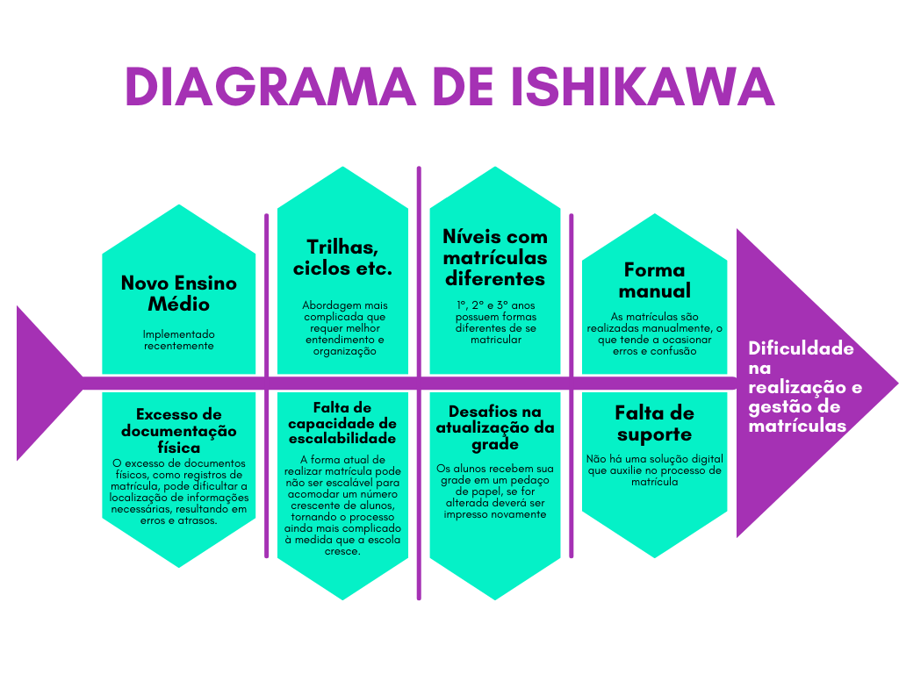

# Visão de Produto

## Histórico de Revisão

| Data | Versão | Descrição | Autores |
| ---------- | ----------- | -------------- | -------------- |
| 25/09/2023 | 0.1 | Criando o Visão de Produto | Luana Ribeiro |
| 25/09/2023 | 0.2 | Adicionando objetivos e declaração de posição de produto | Júlia Yoshida |
| 22/10/2023 | 0.3 | Editando Declaração de Posição de Produto | Luana Ribeiro |

## Problema

 O Problema identificado está relacionado ao Novo Ensino Médio, projeto em vigor nas escolas de Ensino Médio públicas, em que os estudantes possuem as disciplinas do tronco comum (Português, Matemática, Educação Física, História, Geografia) e as demais disciplinas que são consideradas eletivas (Matemática Financeira, Projeto de Vida, etc.), em que os estudantes escolhem quais desejam inserir em suas grades.

 Por ser um projeto aplicado recentemente em uma realidade de escola pública, existe uma dificuldade de compreensão das disciplinas eletivas ofertadas e não há um consenso de como a contemplação dos alunos é realizada, o que dificulta o entendimento e adaptação de toda a comunidade escolar. 

## Declaração de posição de produto

 O produto proposto é uma aplicação web que busca resolver o problema da gestão de matrículas de disciplinas no novo modelo de ensino médio. Por ser um modelo novo de Ensino, ainda não há um suporte tecnológico para esse fim, fazendo com que a escola opte por opções de matrícula manual ou via Google Formulário. O público alvo do Matriculaí serão os alunos e coordenadores da escola CEMTN. Nossa aplicação simplifica e economiza o tempo do estudante e da coordenação, além de dar uma maior visão para os alunos de quais matérias ele pode agregar à sua grade e a melhor forma de gerir suas aulas durante todo o ensino médio. 

| Para | Centro de Ensino Médio Taguatinga Norte (CEMTN) |
| ----- | ----- |
| Quem | Deseja uma plataforma com funcionalidades que permitam a gestão de disciplinas ofertadas numa escola pública de Ensino Médio |
| O Matriculaí |  É uma aplicação web |
| Que | Facilita a gestão das matrículas de disciplinas de Ensino Médio, auxiliando na organização e desempenho |
| Ao contrário | Google Formulário, opção utilizada para fazer a seleção de matrículas |
| Nosso produto | Fornece ao público do Ensino Médio uma forma eficiente e eficaz de gerir as matrículas, substituindo os processos manuais e promovendo a transformação digital  |

## Objetivos

O objetivo principal do Matriculaí é a transformação digital do processo de matrículas em disciplinas do CEMTN, solucionando o problema de dificuldade na gestão da matrícula dos alunos, tanto para os coordenadores organizarem as matrículas e relacioná-las aos estudantes, quanto para os próprios alunos em si, ao realizarem sua escolha de disciplinas e visualizarem sua grade horária.

## Tecnologias Utilizadas

| Função | Tecnologia |
| -------------- | ------------- |
| Frontend | React |
| Backend | Nodejs |
| Testes | Jasmine e Jest |
| Integração contínua | GitActions |
| Banco de dados | MySQL |

## Ferramentas Utilizadas

| Atividade | Tecnologia |
| ----------------------------- | -------------------------------------- |
| Organização e Documentação| Notion   GitHub   Git Pages |
| Comunicação | WhatsApp   Discord   GoogleMeet |
| Desenvolvimento | Visual Studio Code |
